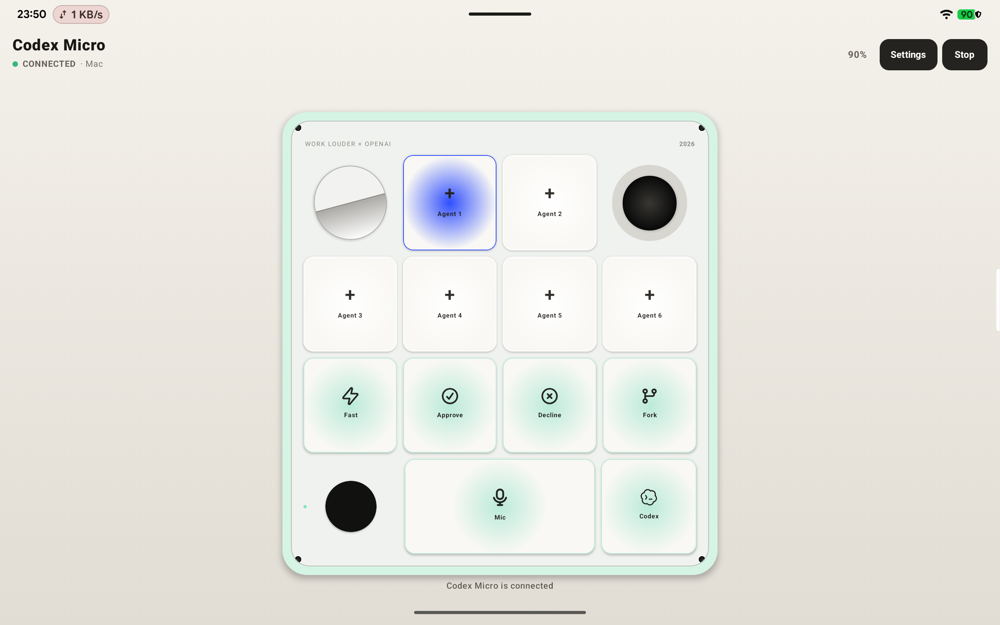

# Codex Macro

[English](README.md)

Codex Macro 是一个实验性的 Android BLE 控制器，可配合 macOS 版 ChatGPT Desktop 的 Codex Micro 功能使用。它会把 Android 设备模拟成 BLE HID-over-GATT 外设，并实现参考 Core2 固件使用的厂商报告协议。

本项目为非官方项目，与 OpenAI、Work Louder、Google 或 Apple 无隶属或背书关系。兼容协议没有公开文档，ChatGPT Desktop 更新后可能失效。

## 截图



## 环境要求

- Android 9 或更高版本
- 支持 Bluetooth LE 外设广播的手机或平板
- 支持 Codex Micro 的 macOS 版 ChatGPT Desktop
- 附近设备权限

## 编译

```shell
./gradlew assembleDebug
```

APK 输出路径为 `app/build/outputs/apk/debug/app-debug.apk`。

## 配对

1. 打开 Codex Macro，点击 **Start**。
2. 授予附近设备权限，并在系统询问时允许开启蓝牙。
3. 在 Mac 上打开蓝牙设置，与 **Codex Micro** 配对。
4. 打开 ChatGPT Desktop，在 **Settings > Codex Micro** 中配置控制器。
5. 如果 macOS 缓存过旧的描述符，请忽略旧设备后重新配对。

默认情况下，应用仅在控制器运行时把 Android 蓝牙名称临时改为 `Codex Micro`，点击 **Stop** 后恢复原名称。可在应用设置中启用 **Stable connection mode**，暂停控制输入时继续保留名称、GATT 服务和主机连接。启用 **Auto resume** 后，进程被回收或设备重启时会恢复此前仍在运行的控制器。两个兼容性选项默认均关闭。

## 控制方式

- **Agent Keys：** Agent 1 至 Agent 6，显示主机下发的状态颜色与呼吸效果。
- **Command Keys：** Fast、Approve、Decline、Fork、Mic 和 Codex Send。
- **摇杆：** 从中心向任意方向拖动，发送连续的径向输入。
- **旋钮：** 按住中心可触发按下/松开；沿外圈拖动可连续触发顺时针或逆时针刻度。
- **Layer：** 点击左下角触摸区循环切换 6 层；旁边三颗指示灯显示当前层。

第 1 层是专用 Codex 层：顶部 6 个 Agent Key 和底部 6 个固定 Codex 动作使用厂商协议，
只有底部 6 个命令图标可以更换。第 2 至 6 层是相互独立的自定义键盘层，每层 12 个按键
都可以选择内置图标或上传图片，并映射为单键或带修饰键的快捷键。当前层和所有自定义布局
都会在重启后恢复。

自定义层使用标准 BLE 键盘 Report，第 1 层继续使用 Codex Micro 厂商 Report。首次安装
包含自定义层的版本后，需要在 macOS 中忽略已缓存的 **Codex Micro** 并重新配对，让主机
重新读取 HID 描述符。

## 常见问题 Q&A

### Q：macOS 能发现设备，但无法联机，或者 ChatGPT 无法识别 Codex Micro，是什么原因？

macOS 可能会按照设备地址缓存蓝牙身份、GATT 服务和 HID 报告描述符。开发过程中曾遇到过这种情况：macOS 能扫描到 Android 设备及其 Human Interface Device 服务，但旧的描述符或设备名称缓存会阻止 Codex Micro 正常联机。仅重新安装 APK 不会清除 Mac 上的蓝牙缓存。

请按以下顺序恢复：

1. 在 Codex Macro 中点击 **Stop**。
2. 在 macOS 蓝牙设置中，忽略所有旧的 **Codex Micro** 以及对应的 Android 设备记录。
3. 关闭再开启 Mac 蓝牙；如果旧记录仍然存在，再重启 Mac。
4. 重新打开 Codex Macro，点击 **Start**，等待状态显示 **PAIRING**。
5. 确认广播名称为 **Codex Micro**，然后从 macOS 重新配对。
6. 配对完成后，完全退出并重新打开 ChatGPT Desktop。
7. 在 macOS **系统设置 > 隐私与安全性 > 输入监控** 中允许 ChatGPT。

### Q：Mac 上能看到设备，但应用仍显示 PAIRING，这算已经连接吗？

不算。**PAIRING** 表示 Android 正在广播 BLE HID 服务，或仍在等待主机及 Codex 握手；只有主机订阅控制器输入并发来有效的 Codex 协议请求后，才会显示 **CONNECTED**。设备出现在 macOS 蓝牙列表中，不代表 ChatGPT 已准备好接收报告。

### Q：macOS 已配对成功，但 ChatGPT 设置中没有 Codex Micro，应该检查什么？

- 确认使用的 ChatGPT Desktop 版本包含 Codex Micro 功能。
- 完成蓝牙配对后重启 ChatGPT Desktop。
- 为 ChatGPT 授予 macOS **输入监控**权限。
- 如果设备之前以手机或平板的原始名称配对过，请忽略设备后重新配对。

### Q：为什么设备有时显示为手机或平板名称，而不是 Codex Micro？

Android 和 macOS 刷新广播名称可能需要一点时间，macOS 也可能继续显示缓存名称。如果主机在 Stop/Start 后反复丢失 BLE 身份，请启用 **Stable connection mode**；启用期间，蓝牙适配器会持续保持名称 **Codex Micro**，直到关闭该选项。

### Q：设备可以被发现，但始终无法进入 CONNECTED，是否所有 Android 设备都兼容？

不是。Android 设备必须支持 BLE 外设广播，并且不同厂商的蓝牙协议栈对应用自建 HID-over-GATT 服务的支持程度不同。能够广播和被发现，不代表 macOS 一定会把它枚举为兼容的 HOGP 硬件。请先执行上述缓存清理流程；仍无法连接时，可以换一台 Android 设备测试。

## 兼容性说明

Android 通过应用自建的 GATT Server 暴露 HID 服务。不同设备厂商的蓝牙控制器实现存在差异，因此广播成功并不保证 macOS 一定能把所有手机枚举为 HOGP 硬件。当前优先兼容 macOS 和 ChatGPT Desktop；Windows、USB HID 及通用键盘主机暂不在支持范围内。

协议行为参考 [imliubo/codex-micro-4-core2](https://github.com/imliubo/codex-micro-4-core2)。第三方归属信息请参阅 [THIRD_PARTY_NOTICES.md](THIRD_PARTY_NOTICES.md)。

## 开源协议

Codex Macro 采用 [GNU Lesser General Public License v3.0 only](LICENSE)（`LGPL-3.0-only`）开源协议。
